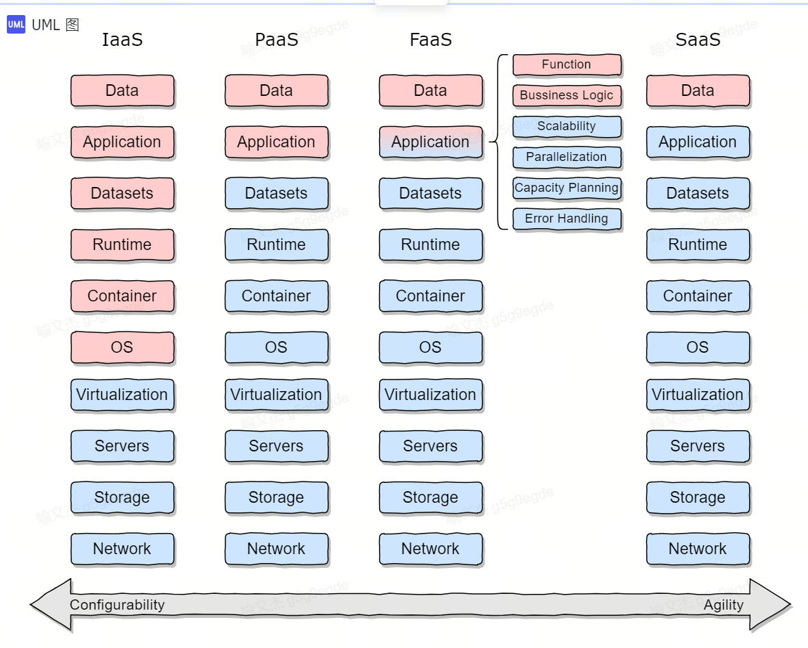

什么时候拆分服务

git仓库

镜像仓库

```

build->
    产生代码制品
```

```
junit
```

```
静态测试（Static Testing）是软件测试的一种方法，主要是通过对程序的源代码、文档、设计、架构等进行检查，而不需要运行程序。静态测试可以在开发的早期阶段进行，目的是发现代码中的潜在缺陷、提高代码质量并减少后续的测试成本。
```


```
sudo kubeadm init \
--apiserver-advertise-address=192.168.32.136 \
--image-repository=registry.aliyuncs.com/google_containers \
--kubernetes-version=v1.28.7 \
--service-cidr=10.96.0.0/12 \
--pod-network-cidr=10.244.0.0/16 \
--cri-socket=unix:///run/containerd/containerd.sock

```

```
sudo kubeadm config images pull \
--image-repository=registry.aliyuncs.com/google_containers \
--kubernetes-version=v1.28.7 \
--cri-socket=unix:///run/containerd/containerd.sock

```


# 问题

生产服务器和测试服务器应不应该部署在一个集群下？ 

nginx


```
架构级
服务级
依赖级
代码级
```


```
页面健全
接口健全
代码约束级

```





用例: 用户使用系统时 为达到特定目的，与系统交互逻辑有序归纳

**实体（Entity）\**通常指的是具有\**唯一标识**的对象或概念


系统是什么  系统使用者  再分析


A用例图 （usecase）

B协作图 （communication）

C泳道图

D时序图


```
ABC 用例分析
D 一般是系统定型后，为了让别人读懂我们的系统
```


用思维导图 不是 用例图

用户防爆力处理 应该在top服务 还是 user服务

top服务中


机器验证 多次错误处理


DDD： 领域模型驱动

定义命名规范


用户服务


user   group   permise...

不要带特定的场景在基础服务中


数据库独立使用

Redis，存权限，


一般是Topbiz去管理Redis


但是在User服务去管理Redis为什么？


学号，工号 ： code

用例是都要写，不是只写要要实现的


用例: XXX管理 就是增删改查 一个路径不同接口搞定

用例与非用例: 有没有非用例对用例没影响

复杂工程问题根据用例分析来


