# 下载jdk17

```bash
wget https://download.java.net/java/GA/jdk17.0.2/dfd4a8d0985749f896bed50d7138ee7f/8/GPL/openjdk-17.0.2_linux-x64_bin.tar.gz

sudo tar zxvf jdk-17_linux-x64_bin.tar.gz

sudo mv jdk-17.0.10//usr/local/jdk-17
# 环境配置
sudo echo "export JAVA_HOME=/usr/local/jdk-17" >> /etc/profile
sudo echo "export PATH=\${PATH}:\${JAVA_HOME}/bin" >> /etc/profile
sudo echo "export CLASSPATH=.:${JAVA_HOME}/lib" >> /etc/profile
source /etc/profile

```

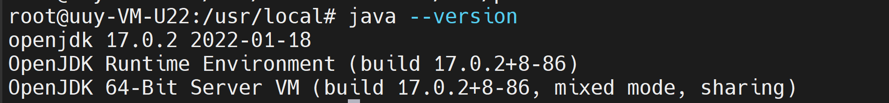


# 下载maven

```bash
wget https://dlcdn.apache.org/maven/maven-3/3.9.6/binaries/apache-maven-3.9.6-bin.tar.gz
sudo tar xzvf apache-maven-3.9.6-bin.tar.gz
mv apache-maven-3.9.6 /usr/local/apache-maven-3.9.6

sudo echo "export M2_HOME=/usr/local/apache-maven-3.9" >> /etc/profile
sudo echo "export PATH=\${M2_HOME}/bin:\${PATH}" >> /etc/profile

source /etc/profile 

```


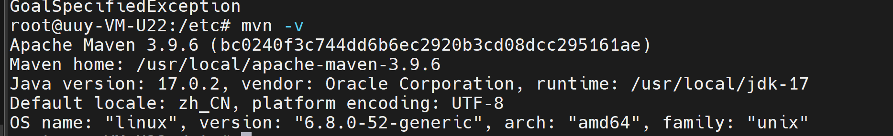

测试仓库是否可用
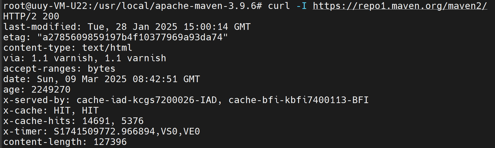

# 构建项目

```bash
cd ~
mkdir java_project
cd java_project
mvn archetype:generate -DgroupId=cc.synx -DartifactId=snowflake \
-DarchetypeArtifactId=maven-archetype-quickstart -DinteractiveMode=false
```

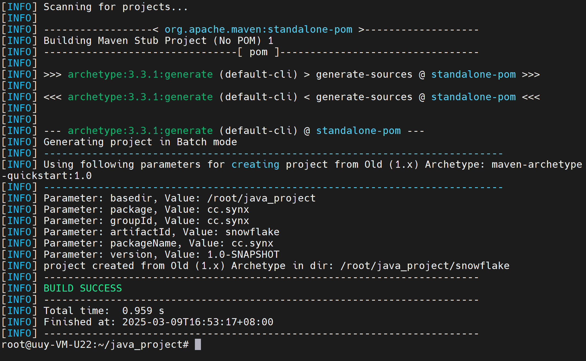

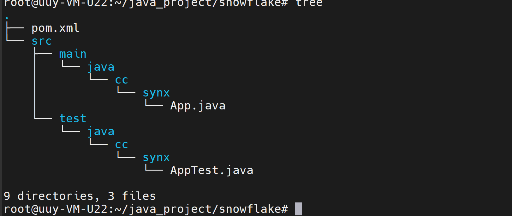


编写SnowFlake代码

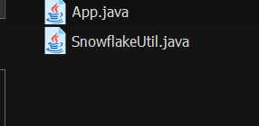

构建

```bash
mvn package
```

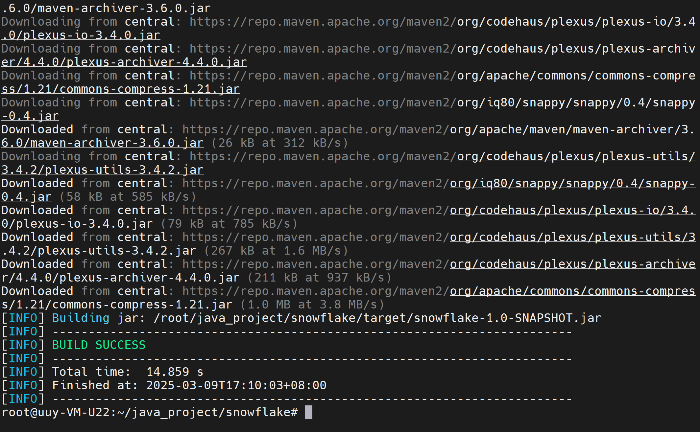


运行

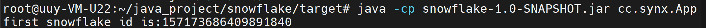

>在 Java 中，`-cp` 或 `-classpath` 参数用于指定运行 Java 程序时的类路径（classpath）。类路径是 Java 虚拟机（JVM）用来查找类文件（`.class` 文件）和包的路径列表。


安装到仓库

```bash
mvn install:install-file -Dfile=target/snowflake-1.0-SNAPSHOT.jar -DgroupId=cc.synx -DartifactId=snowflake -Dversion=1.0 -Dpackaging=jar
```

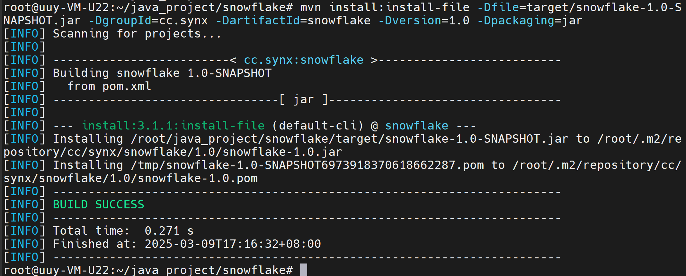


验证
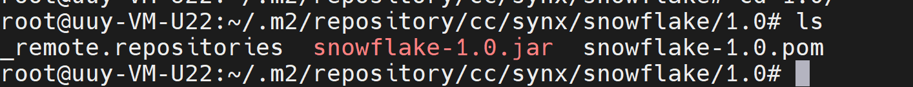


# 配置Maven私有仓库

```bash
sudo docker run -d \
--name nexus \
-u $(id -u):$(id -g) \
-p 8081:8081 \
-v /home/nexus/data:/nexus-data \
-e INSTALL4J_ADD_VM_PARAMS="-Xms128m -Xmx1024m" \
--restart=always \
sonatype/nexus3
```


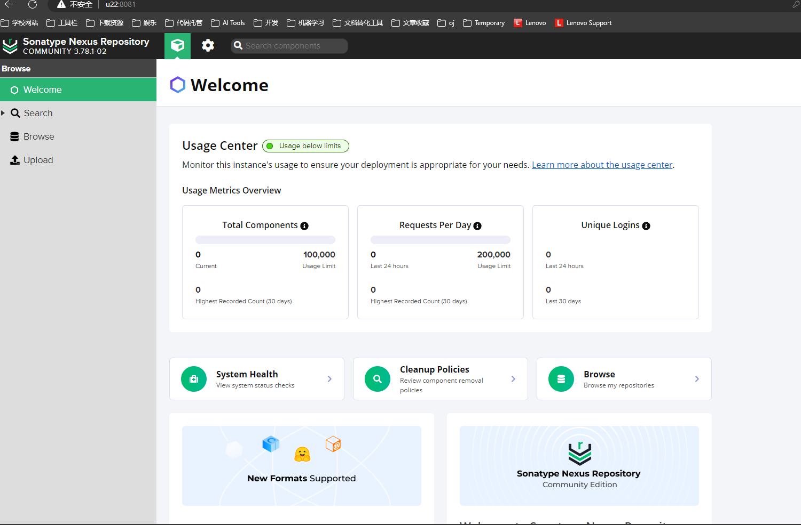


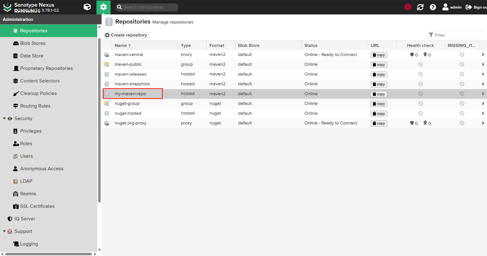


上传

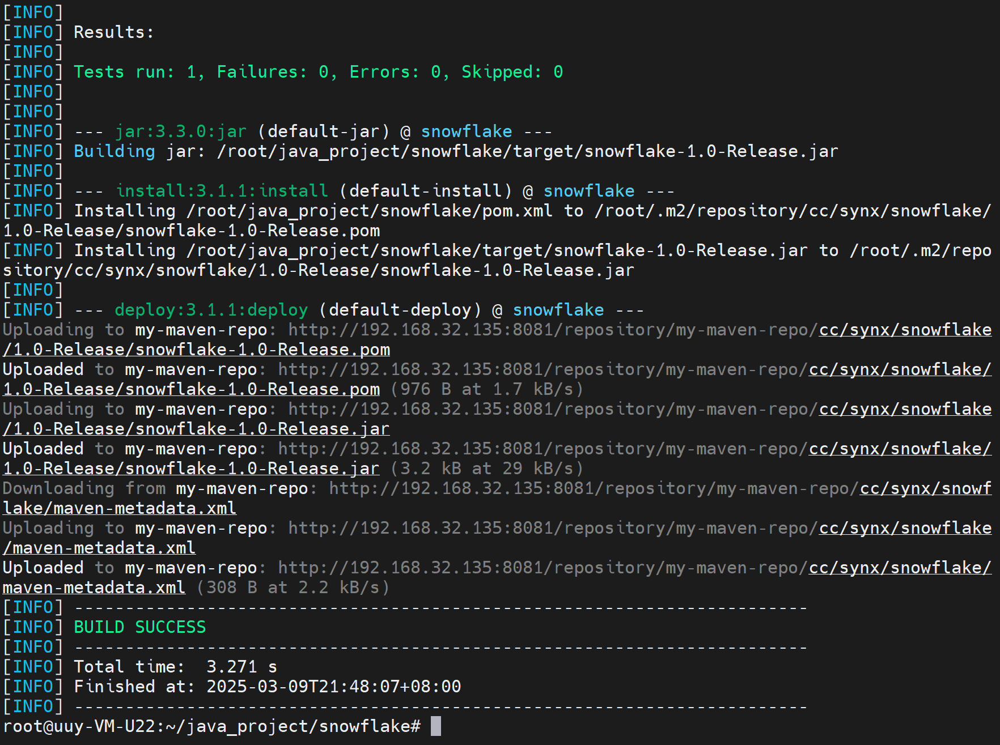


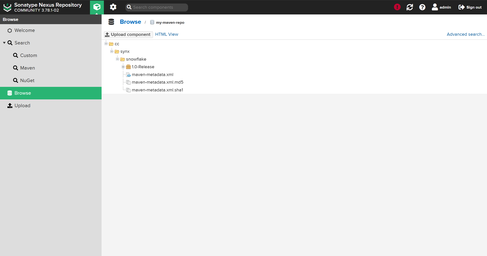


创建新的项目，引入snowflake, 测试

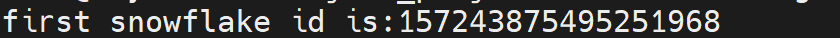

